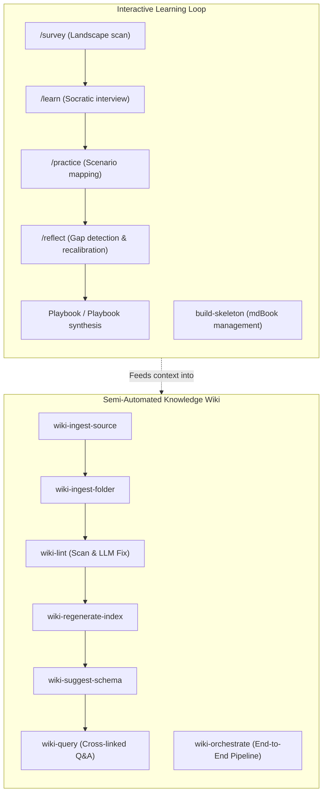

# Learn & Wiki Platform

<div align="center">
  <a href="../../README.md">Home</a> &bull;
  <a href="../../product-strategy/README.md">Product Strategy</a> &bull;
  <a href="../../tech-design/README.md">Tech Design</a> &bull;
  <a href="../../tech-build/README.md">Tech Build</a> &bull;
  <a href="../../visualization/README.md">Visualization</a> &bull;
  <a href="../README.md">Knowledge Management</a> &bull;
  <a href="../../team-collaboration/README.md">Collaboration</a> &bull;
  <a href="../../user-setup/README.md">User Setup</a>
</div>
<br>

An advanced, dual-engine capability domain for managing personal knowledge, structured mental models, and personal wikis. Built specifically for agentic workflows, it moves beyond rigid, static note-taking into dynamic, conversational internalization and semi-automated second brain organization.

---

## Architecture Overview

The **Learn & Wiki Platform** is organized into two highly specialized skill suites:



---

## 1. Interactive Learning Loop (Domain Mastery)

This suite replaces the old, heavy scout-and-map pipelines with a conversational, high-velocity loop for internalizing a new domain. It relies on **Human-In-The-Loop (HITL)** principles—emerging concepts from concrete cases instead of lecturing in a void.

| Skill | Trigger Command | Purpose & Description | Key Deliverable |
| :--- | :--- | :--- | :--- |
| **[survey](skills/survey/)** | `/survey <topic>` | Scans history, key branch developments (recent 5 years), key people, and current controversies to build a structural domain map. | `memory/survey.md` & Mermaid Map |
| **[learn](skills/learn/)** | `/learn <topic>` | Conducts an interactive Socratic interview to surface and sharpen emergent mental models without pre-determined templates. | `memory/model-*.md` & `_models.md` |
| **[practice](skills/practice/)** | `/practice <scenario>` | Applies established mental models to concrete real-world problems. Examines boundary conditions and handles failures as data. | `memory/case-*.md` |
| **[reflect](skills/reflect/)** | `/reflect <topic>` | Conducts periodic reviews of applied cases to calibrate models, surface knowledge gaps, and trigger playbook synthesis. | Revised models, gap reports |
| **[build-skeleton](skills/build-skeleton/)** | `build-skeleton` | Structurally manages chapter stubs and table of contents hierarchy for compiling structured learning books using mdBook. | `./book/src/SUMMARY.md` |

---

## 2. Structured Knowledge Wiki (Second Brain)

A highly structured, pipeline-driven engine to parse unstructured documents into fully cross-linked wiki pages, preserving the separation of **entities**, **concepts**, and **sources** with semantic indexing and linting rules.

| Skill | Trigger Commands / Keywords | Purpose & Description | Output / Target |
| :--- | :--- | :--- | :--- |
| **[wiki-orchestrate](skills/wiki-orchestrate/)** | `wiki-orchestrate` | Orchestrates the entire pipeline end-to-end: ingestion, linting, index regeneration, schema recommendations, and query verification. | Full Wiki Vault |
| **[wiki-ingest-source](skills/wiki-ingest-source/)** | `wiki-ingest-source` | Parses a single unstructured markdown note, extracting core entities and concepts into cross-linked, frontmatter-backed wiki entries. | `{wiki}/{type}/{slug}.md` |
| **[wiki-ingest-folder](skills/wiki-ingest-folder/)** | `wiki-ingest-folder` | Batch-ingests an entire directory of notes serially, automatically skipping files that have already been imported. | Serial Vault Ingestion |
| **[wiki-lint](skills/wiki-lint/)** | `wiki-lint`, `wiki-lint fix` | Scans the wiki for anomalies (dead links, duplicates, orphan nodes, empty pages) and runs LLM-powered repairs. | Vault Cleanliness Report |
| **[wiki-regenerate-index](skills/wiki-regenerate-index/)** | `wiki-regenerate-index` | Idempotently rebuilds the main catalog or table of contents file based on all active entity, concept, and source pages. | `{wiki}/index.md` |
| **[wiki-suggest-schema](skills/wiki-suggest-schema/)** | `wiki-suggest-schema` | Evaluates wiki contents against current metadata config rules to propose structural and naming convention improvements. | `{wiki}/schema/suggestions.md` |
| **[wiki-query](skills/wiki-query/)** | `wiki-query` | Performs semantic context matching, loads matching nodes, and answers questions using strict cross-linked wiki links. | Conversational Q&A |

---

## Core Conventions

To ensure flawless interoperability, all tools in this platform adhere to standard organizational rules:

### Directory Architecture

Every topic is isolated under its own clean folder space:
```
topics/<slug>/
├── README.md               # Automatically managed landing metadata
└── memory/                 # Flat directory containing all knowledge assets
    ├── survey.md           # Domain landscape mapping & survey
    ├── _models.md          # Registry index of all active mental models
    ├── model-*.md          # Individual 30-second readable mental models
    ├── case-*.md           # Concrete scenarios demonstrating model failures/successes
    └── playbook.md         # Synthesized personal playbook (after 5+ cases)
```

### Wiki Storage Hierarchy
```
wiki/
├── entities/               # People, projects, organizations, tools
├── concepts/               # Ideas, patterns, algorithms, methodologies
├── sources/                # Books, papers, logs, URLs, original notes
├── schema/                 # Configuration rules and suggestions
└── index.md                # Automatically regenerated catalog root
```

> [!IMPORTANT]
> **Reviewed Page Protection**: Any page containing `reviewed: true` in its YAML frontmatter is treated as human-validated. The automated wiki pipeline will protect these files, making them append-only or requiring manual confirmation before any edits are performed.

---

## Inspiration & Comparative Analysis

The **Structured Knowledge Wiki** suite is directly inspired by [Andrej Karpathy's `llm-wiki` design pattern](https://gist.github.com/karpathy/442a6bf555914893e9891c11519de94f). We have taken Karpathy's high-level concept of a persistent, compounding, LLM-maintained second brain and instantiated it into a suite of production-grade agent skills.

### Key Differences & Extension Points

While the core philosophy remains aligned—offloading the tedious bookkeeping of a knowledge base to an LLM—our implementation introduces several critical extension points to handle real-world agentic execution:

| Architectural Component | Karpathy's Concept (`llm-wiki.md`) | Our Implementation (`wiki-*` Skills) |
| :--- | :--- | :--- |
| **Wiki Organization** | Generic directory of markdown files. | Strict, formalized schema dividing notes into `/entities`, `/concepts`, and `/sources`. |
| **Ingestion Pipeline** | A single ingest description covering parsing and cross-linking. | Decoupled, multi-stage pipeline (`wiki-ingest-source` & batch-driven `wiki-ingest-folder`). |
| **Linter & Cleanup** | Periodic health check recommendations. | Automated, LLM-powered executable linter (`wiki-lint` & `wiki-lint fix`) that repairs broken links, duplicates, empty pages, and orphan nodes. |
| **Index Maintenance** | LLM-written catalog (`index.md`) updated on every ingest. | Fast, idempotent index rebuild (`wiki-regenerate-index`) that runs programmatically without costly LLM re-generation. |
| **Configuration** | Static workspace rules (`CLAUDE.md`, `AGENTS.md`). | Active schema evaluator (`wiki-suggest-schema`) analyzing structure and appending changes to `suggestions.md` for human review. |
| **Data Integrity** | Fully automated edits where the "LLM writes all of it." | **Reviewed Page Protection**: Strict frontmatter rules (`reviewed: true`) to write-protect human-validated content from automated LLM overwrites. |

---

## Future Possibilities & Roadmap

To expand further on our implementation and address edge-case friction points uncovered in actual day-to-day use (as highlighted in the community responses on Karpathy's gist), we have laid out the following roadmap for upcoming iterations:

### 1. Triage-First Ingestion
* **Goal**: Prevent LLMs from writing directly to the vault before confirmation.
* **Mechanism**: Develop a front-facing `wiki-triage` skill that acts as a dry-run. It will scan the incoming raw material, generate a structural diff showing proposed page creations or edits, and display a report of any potential contradictions *before* writing to disk.

### 2. Cross-Page Contradiction & Contested Claims
* **Goal**: Reconcile logical conflicts instead of letting the agent silently pick a side or overwrite older findings.
* **Mechanism**: Enhance the `wiki-lint` scan phase to detect semantic discrepancies across files, compiling a `contested-claims.md` report that highlights conflicting excerpts and offers explicit reconciliation routes for human review.

### 3. Provenance & Integrity Tracking (SHA-256)
* **Goal**: Ensure the generated wiki entries stay in sync with the immutable raw documents.
* **Mechanism**: Embed a body-only SHA-256 checksum inside the YAML frontmatter of each `/sources` page. The linter can verify this signature to flag when raw files have drifted, been renamed, or been deleted from the local disk.

### 4. Walk-Up Path Discovery
* **Goal**: Allow tools to resolve the wiki path from any subdirectory within the workspace.
* **Mechanism**: Enable recursive upward directory discovery (scanning for `wiki/schema/config.md`) so that agents can execute wiki commands regardless of their current working directory context.

### 5. Local Hybrid Search MCP Integration
* **Goal**: Scale beyond simple index-file parsing when vaults grow to thousands of pages.
* **Mechanism**: Integrate specialized local markdown search engines (such as `qmd` or lightweight BM25/vector search CLI utilities) via a Model Context Protocol (MCP) server, allowing the agent to perform instant, high-relevance hybrid queries.
