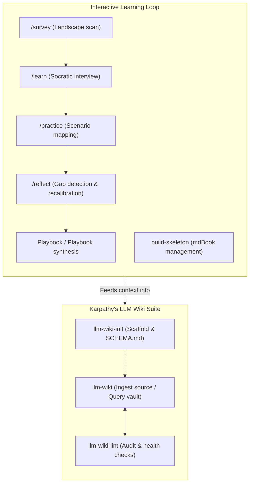

# Learn & Wiki Platform

<div align="center">
  <a href="../../README.md">Home</a> &bull;
  <a href="../../product-strategy/README.md">Product Strategy</a> &bull;
  <a href="../../tech-design/README.md">Tech Design</a> &bull;
  <a href="../../tech-build/README.md">Tech Build</a> &bull;
  <a href="../../visualization/README.md">Visualization</a> &bull;
  <a href="../README.md">Knowledge Management</a> &bull;
  <a href="../../team-collaboration/README.md">Collaboration</a> &bull;
  <a href="../../user-setup/README.md">User Setup</a>
</div>
<br>

An advanced, dual-engine capability domain for managing personal knowledge, structured mental models, and personal wikis. Built specifically for agentic workflows, it moves beyond rigid, static note-taking into dynamic, conversational internalization and semi-automated second brain organization.

---

## Architecture Overview

The **Learn & Wiki Platform** is organized into two highly specialized skill suites:



---

## 1. Interactive Learning Loop (Domain Mastery)

This suite replaces the old, heavy scout-and-map pipelines with a conversational, high-velocity loop for internalizing a new domain. It relies on **Human-In-The-Loop (HITL)** principles—emerging concepts from concrete cases instead of lecturing in a void.

| Skill | Trigger Command | Purpose & Description | Key Deliverable |
| :--- | :--- | :--- | :--- |
| **[survey](skills/survey/)** | `/survey <topic>` | Scans history, key branch developments (recent 5 years), key people, and current controversies to build a structural domain map. | `memory/survey.md` & Mermaid Map |
| **[learn](skills/learn/)** | `/learn <topic>` | Conducts an interactive Socratic interview to surface and sharpen emergent mental models without pre-determined templates. | `memory/model-*.md` & `_models.md` |
| **[practice](skills/practice/)** | `/practice <scenario>` | Applies established mental models to concrete real-world problems. Examines boundary conditions and handles failures as data. | `memory/case-*.md` |
| **[reflect](skills/reflect/)** | `/reflect <topic>` | Conducts periodic reviews of applied cases to calibrate models, surface knowledge gaps, and trigger playbook synthesis. | Revised models, gap reports |
| **[build-skeleton](skills/build-skeleton/)** | `build-skeleton` | Structurally manages chapter stubs and table of contents hierarchy for compiling structured learning books using mdBook. | `./book/src/SUMMARY.md` |

---

## 2. Karpathy's LLM Wiki Suite (Compounding Second Brain)

An elegant, low-overhead suite modeled on [Andrej Karpathy's LLM Wiki pattern](https://gist.github.com/karpathy/442a6bf555914893e9891c11519de94f). By consolidating complex pipelines into a cohesive triad, this suite enables agents to build a compounding, self-indexing knowledge base of interlinked markdown pages while preserving taxonomic tag consistency, absolute source immutability, and human-in-the-loop takeaways.

| Skill | Trigger Commands / Keywords | Purpose & Description | Output / Target |
| :--- | :--- | :--- | :--- |
| **[llm-wiki-init](skills/llm-wiki-init/)** | `llm-wiki-init`, `create a wiki`, `start a knowledge base` | Scaffold directory structures, configure `SCHEMA.md` conventions, define taxonomic tag taxonomy, and initialize `index.md` and git tracking. | `wiki/SCHEMA.md`, `index.md`, `log.md` |
| **[llm-wiki](skills/llm-wiki/)** | `llm-wiki`, `ingest source`, `query wiki`, `wiki-query` | Captures raw sources (`raw/`), performs two-pass parallel extraction & page generation, automatically manages indexing, handles updates/contradictions, and files valuable query results. | `raw/`, `entities/`, `concepts/`, `comparisons/`, `queries/`, `index.md` |
| **[llm-wiki-lint](skills/llm-wiki-lint/)** | `llm-wiki-lint`, `wiki lint`, `audit wiki`, `health-check` | Runs a comprehensive 12-point health audit covering broken links, orphan nodes, frontmatter compliance, raw source SHA-256 drift, contested claims, and stale pages. | `log.md`, `log-YYYY.md` (rotation), detailed reports |

---

## Core Conventions

To ensure flawless interoperability, all tools in this platform adhere to standard organizational rules:

### Directory Architecture (Learning Loop)

Every topic is isolated under its own clean folder space:
```
topics/<slug>/
├── README.md               # Automatically managed landing metadata
└── memory/                 # Flat directory containing all knowledge assets
    ├── survey.md           # Domain landscape mapping & survey
    ├── _models.md          # Registry index of all active mental models
    ├── model-*.md          # Individual 30-second readable mental models
    ├── case-*.md           # Concrete scenarios demonstrating model failures/successes
    └── playbook.md         # Synthesized personal playbook (after 5+ cases)
```

### Wiki Storage Hierarchy (LLM Wiki Vault)
```
wiki/
├── SCHEMA.md               # Rules, conventions, domain tags, & thresholds
├── index.md                # Automatically regenerated catalog root (with summaries)
├── log.md                  # Chronological append-only action record
├── raw/                    # Layer 1: Immutable source material
│   ├── articles/           # Captured web posts and notes
│   ├── papers/             # Academic pdfs and summaries
│   ├── transcripts/        # Video/audio text captures
│   └── assets/             # Raw images and supplemental files
├── entities/               # Layer 2: People, products, orgs, models
├── concepts/               # Layer 2: Ideas, algorithms, methodologies, patterns
├── comparisons/            # Layer 2: Side-by-side analyses
└── queries/                # Layer 2: Preserved high-value query answers
```

> [!IMPORTANT]
> **Contested Claim Tracking**: If a new source contradicts an existing page, the agent does not silently overwrite it. Instead, both positions are documented with dates and sources, and the target page's frontmatter is marked with `contested: true` and `contradictions: [other-page-slug]`. The `llm-wiki-lint` tool actively audits these flags to surface contested content for human resolution.

---

## Inspiration & Comparative Analysis

The new **LLM Wiki Suite** is directly inspired by [Andrej Karpathy's `llm-wiki` design pattern](https://gist.github.com/karpathy/442a6bf555914893e9891c11519de94f). We have taken Karpathy's high-level concept of a persistent, compounding, LLM-maintained second brain and instantiated it into a suite of production-grade agent skills.

### Key Differences & Extension Points

While the core philosophy remains aligned—offloading the tedious bookkeeping of a knowledge base to an LLM—our implementation introduces several critical extension points to handle real-world agentic execution:

| Architectural Component | Karpathy's Concept (`llm-wiki.md`) | Our Implementation (`llm-wiki-*` Suite) |
| :--- | :--- | :--- |
| **Wiki Organization** | Generic directory of markdown files. | Formalized two-layer schema: Layer 1 (`raw/` sources) and Layer 2 (`entities/`, `concepts/`, `comparisons/`, `queries/`). |
| **Ingestion Protocol** | Single-pass ingestion. | **Two-Pass Parallel Ingest** for long files (Pass 1: Extract, Pass 2: Write) + Socratic discussion of takeaways before filing. |
| **Incremental Ingest** | Full re-processing of inputs. | **Differential Ingest** with skip logic using body-only SHA-256 signatures and chronological logs. |
| **Linter & Cleanup** | General advice to audit files. | Automated **12-point health linter (`llm-wiki-lint`)** grouped by severity (Critical to Info) with safe auto-fixes and human-review flags. |
| **Index & Navigation** | Continuous index rewriting. | Fast, programmatic index updates (`index.md`) using strict structural thresholds to split/map topics as the vault scales. |
| **Contradiction Management** | Manual resolution. | Active **Contradiction Handling**: frontmatter marking (`contested: true`, `contradictions: [...]`) with dedicated auditing in the linter report. |

---

## Future Possibilities & Roadmap

To expand further on our implementation and address edge-case friction points uncovered in actual day-to-day use, we have laid out the following roadmap for upcoming iterations:

### 1. Triage-First Ingestion (`llm-wiki-triage`)
* **Goal**: Prevent LLMs from writing directly to the vault before confirmation.
* **Mechanism**: Develop a front-facing dry-run mode that scans incoming raw material, generates a structural diff showing proposed page creations or edits, and displays a report of any potential contradictions *before* writing to disk.

### 2. Walk-Up Path Discovery
* **Goal**: Allow tools to resolve the wiki path from any subdirectory within the workspace.
* **Mechanism**: Enable recursive upward directory discovery (scanning for `wiki/SCHEMA.md`) so that agents can execute wiki commands regardless of their current working directory context.

### 3. Local Hybrid Search MCP Integration
* **Goal**: Scale beyond simple index-file parsing when vaults grow to thousands of pages.
* **Mechanism**: Integrate specialized local markdown search engines (such as `qmd` or lightweight BM25/vector search CLI utilities) via a Model Context Protocol (MCP) server, allowing the agent to perform instant, high-relevance hybrid queries.
