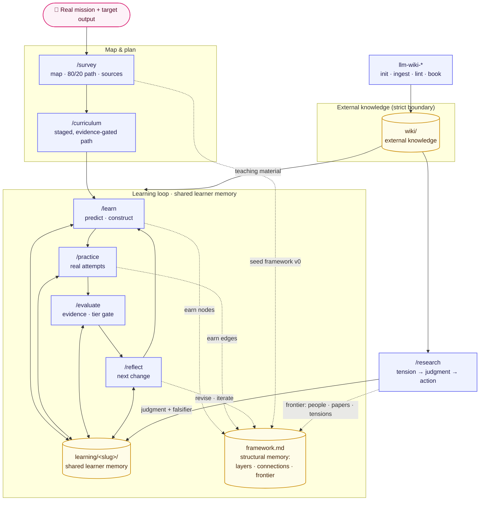

# Learning OS

Last updated: 2026-07-25

<div align="center">

[](.claude-plugin/plugin.json)
[](https://agentskills.io)
[](LICENSE)

**Use AI to learn — not to have it learn for you.**

AI makes consuming knowledge nearly free, but consuming is not learning. Learning OS is a file-based system that turns an AI agent into a tutor, coach, and evaluator: AI accelerates mapping, explanation, practice, and feedback, while the learner supplies the predictions, attempts, explanations, decisions, and judgment that make capability durable — until the assistance is no longer needed.

</div>

## Table of Contents

- [What Is This?](#what-is-this)
- [Architecture](#architecture)
- [Getting Started](#getting-started)
- [The Skills](#the-skills)
- [Core Thesis](#core-thesis)
- [Design Principles](#design-principles)
- [Operating Model](#operating-model)
- [File Contracts](#file-contracts)
- [Evidence Model](#evidence-model)
- [Cross-Cutting Rules](#cross-cutting-rules)
- [Theoretical Foundation](#theoretical-foundation)
- [Non-Goals](#non-goals)
- [Repository Structure](#repository-structure)
- [Project Status](#project-status)
- [License](#license)
- [Contact](#contact)

## What Is This?

Reading an AI-generated explanation feels like learning, but it produces familiarity, not capability. Learning OS exists to close that gap: it packages seven learning skills and four knowledge-base skills that turn an AI agent from an answer machine into a tutor, coach, and evaluator — one that requires you to predict, attempt, explain, and retry before anything counts as learned.

Each skill is a plain-Markdown `SKILL.md` in the open [Agent Skills](https://agentskills.io) format, so the suite is not tied to one tool: install it as a [Claude Code](https://docs.anthropic.com/en/docs/claude-code) plugin, drop the skill directories into any agent that discovers skills (Codex, Cursor, custom Claude Agent SDK agents, …), or paste a `SKILL.md` into any capable LLM chat as instructions.

Everything is plain Markdown and HTML files on disk. Each topic has one shared learner-memory system under `learning/<slug>/`; skills coordinate by reading and writing those files, never through hidden session state. Every artifact — your course, notes, attempt history, evidence, and playbook — is inspectable, versionable, and yours.

> [!NOTE]
> This README is the canonical **target architecture**. [GAP_ANALYSIS.md](GAP_ANALYSIS.md) audits the current skills against it and ranks the work still required. The project was extracted from [agent-skills](https://github.com/XinheLIU/agent-skills) into its own repository.

## Architecture

Each component is an atomic skill with file-based inputs and outputs. The learning-loop skills surround one shared topic memory: they read the learner's current state before acting and write durable attempts, evidence, and adaptations afterward. Because coordination happens through files rather than hidden session state, each skill remains independently testable and replaceable.



See [The Skills](#the-skills) for each component's responsibility and durable output.

<p align="right">(<a href="#learning-os">back to top</a>)</p>

## Getting Started

### Prerequisites

Any AI agent that supports Markdown skills — Claude Code, Codex, or another skills-aware agent. As a fallback, any capable LLM chat works: the skills are plain instructions.

### Install

**Option A — Claude Code plugin** (inside a Claude Code session):

```text
/plugin marketplace add XinheLIU/learning-os
/plugin install learning-os@learning-os
```

**Option B — any skills-aware agent:** copy or symlink the skill directories into your agent's skills discovery path, e.g.:

```bash
git clone https://github.com/XinheLIU/learning-os
ln -s "$(pwd)/learning-os/skills/"* ~/.claude/skills/   # Claude Code, without the plugin
ln -s "$(pwd)/learning-os/skills/"* ~/.agents/skills/   # Codex and other agents
```

**Option C — no agent at all:** open the relevant `skills/<name>/SKILL.md` and paste it into an LLM chat as instructions. Each `SKILL.md` is self-contained; you play the role of the file system.

### First session

Skills read and write files relative to **the directory where you run your agent** — pick (or create) a folder you want to keep your learning materials in, then invoke the skills by name (shown here as Claude Code slash commands):

```text
/survey distributed systems        # ~30 min: map the field, triage DEEP/SKIM/SKIP, pick sources
/curriculum consensus algorithms   # design + build an HTML course grounded in the survey
/learn consensus algorithms        # be tutored through the next lesson, dialogue-first
```

After a few `/learn` sessions, close the loop:

```text
/practice debug a raft election    # deliberate practice on a real case you bring
/evaluate consensus algorithms     # evidence-backed mastery snapshot (no scores)
/reflect consensus algorithms      # compress errors into what changes next
```

Your first success: after `/curriculum`, open `learning/<slug>/index.html` in a browser — that is your course shell, and `learning/<slug>/syllabus.md` is the plan `/learn` will tutor you through.

## The Skills

Seven Learning OS commands plus a four-skill LLM Wiki suite for durable external knowledge:

| Component | Command or skill | Primary responsibility | Durable output |
| :--- | :--- | :--- | :--- |
| Investment gate | `/survey` | Define the map, critical path, source set, and baseline | `survey.md`, `framework.md` v0 |
| Course designer | `/curriculum` | Plan backward from the output and build the Tier-1 course | `syllabus.md`, HTML course (K/S lessons + loop-entry specs) |
| AI tutor | `/learn` | Run prediction, construction, feedback, retry, and compression | lesson progress, `notes.md`, `reference/`, promoted framework nodes |
| Practice coach | `/practice` | Train one micro-skill on a real case and record attempts | `drills-*.md`, `case-*.md`, earned framework edges |
| Evaluator | `/evaluate` | Assess evidence, transfer, and independence; gate the tiers | Mastery Snapshot in `notes.md` |
| Feedback loop | `/reflect` | Convert errors and drift into changed models and next attempts | model revisions, micro-goals, `playbook.md`, framework iterations |
| Research companion | `/research` | Resolve a live tension into the learner's judgment and action; extend the frontier | `research-*.md`, `framework.md` frontier |
| Wiki bootstrap | `llm-wiki-init` | Scaffold a new external knowledge base | `wiki/` skeleton |
| Knowledge distillation | `llm-wiki-ingest` | Preserve and distill curated sources | `raw/`, source-faithful pages |
| Wiki maintenance | `llm-wiki-lint` | Audit links, orphans, drift, and tag sprawl | audit reports |
| Book planner | `llm-wiki-book` | Turn a mature wiki into a thesis and narrative plan | book plan document |

Detailed behavior lives with each skill under [skills/](skills/).

<p align="right">(<a href="#learning-os">back to top</a>)</p>

## Core Thesis

Learn toward an output, not a subject.

A topic is unbounded. An output creates a boundary, a quality bar, and evidence:

```text
"Learn SQL"                           -> unbounded subject
"Diagnose and fix our slow report"   -> real output
"Explain the query plan unaided"     -> evidence of understanding
"Fix a new slow query unaided"       -> evidence of transfer
```

The system optimizes the shortest useful loop between ignorance and correction. Every pass reads from and writes to the same topic memory:

```text
┌────────────────────── learning loop ──────────────────────┐
│ retrieve -> predict -> attempt -> feedback -> retry       │
│     ↑                                      ↓              │
│     └── learning/<slug>/ shared memory <── record         │
└────────────────────────────────────────────────────────────┘
                              |
                              +-> compress -> transfer -> update the path
```

Reading speed is not the bottleneck. Iteration speed is. Feedback matters only when it changes the next attempt, and AI assistance succeeds only when it can be reduced over time.

## Design Principles

| Area | Principle | Design consequence |
| :--- | :--- | :--- |
| Direction | Learn toward an output, not a subject. | Every topic begins with a real deliverable and observable success criteria. |
| Direction | Build the map before exploring the territory. | Identify prerequisites, core concepts, advanced branches, and the critical path before deep study. |
| Direction | AI provides speed; judgment provides direction. | AI proposes the map and path; the learner confirms the mission, tradeoffs, and final judgment. |
| Cognition | Let AI guide thought, not replace it. | AI asks, decomposes, hints, challenges, and gives feedback; the learner constructs the answer. |
| Cognition | Prediction creates learning; explanation creates familiarity. | Ask for a prediction or attempt before revealing an explanation whenever prerequisites permit. |
| Cognition | Practice begins before understanding feels complete. | Each small knowledge chunk is followed immediately by use; practice does not wait for total coverage. |
| Cognition | Every input becomes an output. | A source, lesson, or explanation must produce a prediction, example, solution, explanation, decision, or artifact. |
| Practice | Real problems teach faster than artificial exercises. | Prefer the learner's live tasks; use synthetic exercises only to isolate a blocked micro-skill. |
| Practice | Feedback is valuable only when it changes the next attempt. | Every correction is followed by a retry or a stated change tested in the next case. |
| Practice | Mistakes are a personalized curriculum. | Errors are recorded, clustered, and converted into the next micro-goals. |
| Practice | Debugging reveals deeper understanding than memorization. | Learners diagnose failures, state hypotheses, test them, and revise the model. |
| Memory | Compression turns information into knowledge. | Learners produce concise models, checklists, explanations, and playbooks after use. |
| Memory | Retrieval strengthens memory; rereading strengthens illusion. | Sessions open with recall from memory and interleave earlier knowledge. |
| Memory | Teach to discover what you do not understand. | Learners explain in plain language; AI attacks omissions and hidden assumptions. |
| Memory | Store insights as reusable systems, not scattered notes. | Earned knowledge becomes records, reference material, error patterns, and defended playbooks. |
| Autonomy | Reduce guidance until the learner can act alone. | Track assistance used and deliberately fade examples, prompts, hints, and checks. |
| Autonomy | Measure independent capability, not time spent. | Advancement requires unaided output on a new case, not lesson completion or study hours. |
| Autonomy | The fastest learner is the fastest iterator. | Keep attempt-feedback-retry cycles small and frequent. |
| Autonomy | Tenfold learning comes from shortening ignorance-to-correction. | Put feedback and retry inside the same session and feed recurring errors into the next one. |
| Autonomy | The purpose of AI-assisted learning is to need less assistance. | Graduation means producing and judging the target output without AI support. |

<p align="right">(<a href="#learning-os">back to top</a>)</p>

## Operating Model

The journey climbs three tiers on one shared mastery ladder. Each tier owns its rungs, and `/evaluate` — the tier gate — declares a mainline's transition only when the exit evidence exists:

| Tier | Skills | Builds | Owns rungs | Exit gate (per mainline) |
| :--- | :--- | :--- | :--- | :--- |
| 1 — Course | `/survey` → `/curriculum` → `/learn` | knowledge → skill | can-recall, can-apply | all K/S lessons closed; every can-apply cell's named sample reproduced at assistance ≤ hint |
| 2 — Learning loop | `/practice` ⇄ `/reflect` (+ `/evaluate`) | skill → wisdom | can-transfer | target cell evidenced by a case outside the home domain or on the learner's own project (none/hint); ≥1 earned cross-mainline edge in `framework.md` |
| 3 — Research companion | `/research` (+ wiki) | wisdom → generation | can-generate → can-teach | research report with judgment + falsifier; graduation = teach-back that survives a misconception |

Throughout, `framework.md` is the convergence target: `/survey` seeds its skeleton top-down, the loop earns it bottom-up, and `/research` grows it past the course.

### 1. Define the output

Start with a mission that changes something in the learner's work or life. Define:

- **Target output:** what the learner will produce or do.
- **Quality bar:** what a good result must satisfy.
- **Transfer test:** a new situation in which the capability must still work.
- **Independence test:** the same class of task completed without AI guidance.
- **Constraints:** time, tools, prior knowledge, and explicit non-goals.

Time is a planning constraint, not evidence of learning.

### 2. Build the map

Before deep study, `/survey` creates a bounded field map:

- prerequisites, core knowledge, and advanced branches;
- the 20% of concepts that unlock roughly 80% of common work;
- DEEP, SKIM, and SKIP decisions with reasons;
- a diagnosis of current capability, based on probes rather than self-report;
- three to five high-value resources, each annotated with what it is for;
- controversies and unknowns that may need `/research`.

The map is a hypothesis. Evidence from practice can send the learner back to revise it.

### 3. Plan backward from capability

`/curriculum` turns the output and map into a staged path. A default plan uses weekly checkpoints for coordination, but each checkpoint is gated by evidence:

| Stage | Input | Practice | Required output |
| :--- | :--- | :--- | :--- |
| Orient | Map and a minimal worked example | Predict outcomes and identify unknowns | Baseline attempt |
| Build | One prerequisite or core chunk | Retrieval and a small application | Plain-language model or solved subproblem |
| Integrate | Several earned chunks | Whole-task attempt | Target output with limited guidance |
| Transfer | A new real case | Diagnose, decide, and act | Target output in a different context |
| Graduate | No new instruction | Independent performance | Output meeting the quality bar unaided |

Knowledge, skill, and wisdom still form a depth ladder, but not a waterfall. The loop is local: learn one necessary chunk, use it, inspect failure, then learn the next chunk.

### 4. Run the learning loop

`/learn`, `/practice`, `/evaluate`, and `/reflect` form one loop around `learning/<slug>/`. They do not hand state directly to one another: each reads the shared files it needs and writes durable evidence for the next skill. Within that system, `/learn` and `/practice` use one invariant attempt loop:

```text
1. Retrieve a prerequisite from memory.
2. Predict or attempt before seeing the answer.
3. Receive the minimum explanation or worked example needed.
4. Explain, solve, or demonstrate in the learner's own words.
5. Get precise feedback, ordered by severity.
6. Retry the same task or a near-transfer variant.
7. Compress the corrected model into a reusable artifact.
8. Record the assistance used and set the next attempt.
```

For a true novice, the initial prediction is low-stakes and the explanation can be direct. The learner still has to construct and retry before the segment closes.

### 5. Use the AI Feynman protocol

For a difficult concept:

1. **Minimal explanation:** AI explains it in language a 12-year-old can understand, gives three real examples, and avoids unnecessary terminology.
2. **Closed-book teach-back:** the learner closes the material and explains the concept in their own words.
3. **Adversarial feedback:** AI lists errors, omissions, and distortions in severity order.
4. **Correction:** the learner studies only the identified gaps.
5. **Retry:** the learner explains again or applies the concept to a new case.

Example prompts:

```text
Explain <concept> in language a 12-year-old can understand. Give three
real examples and avoid specialist terms. Before explaining, ask me for
one prediction about how it behaves.
```

```text
I will explain <concept> from memory. Identify errors, omissions, and
distortions, ordered by severity. Do not rewrite it for me; ask me to
correct the most serious issue first.
```

Familiarity with the AI's explanation is not completion. A corrected learner explanation or application is.

### 6. Turn errors into the next curriculum

`/practice` captures errors from real cases. `/reflect` compresses recurring patterns and changes the next micro-goal. A useful error record contains:

```text
attempt -> observed failure -> hypothesis -> feedback -> retry -> result
```

Debugging is the preferred learning mode when a model fails: reproduce the failure, localize it, predict a cause, test the prediction, and revise the model.

### 7. Compress and store what was earned

The system separates external information from learner-owned knowledge:

- `wiki/` stores source-faithful external knowledge.
- `learning/<slug>/` is the shared memory of the learning loop: it stores the plan, capabilities, attempts, assistance, evaluation, and adaptations earned through work.

Compression happens after construction. AI may propose a draft, but an artifact becomes earned knowledge only after the learner can explain, use, or defend it. Durable outputs include:

- concise mental models and canonical terms in `notes.md`;
- earned structure — layered nodes, labeled connections, the frontier — in `framework.md`;
- printable reference cards in `reference/`;
- micro-skill maps in `drills-*.md`;
- real attempts and error histories in `case-*.md`;
- judgments and falsifiers in `research-*.md`;
- defended procedures and decision rules in `playbook.md`.

### 8. Fade support and prove independence

Assistance should move in one direction:

```text
worked example -> partial example -> prompts -> hints on request ->
feedback after attempt -> feedback after completion -> unaided transfer
```

`/evaluate` measures the strongest evidence available and records how much assistance produced it. `/reflect` chooses what support to remove next. A learner graduates only when they can produce the target output on a new case, explain the important decisions, diagnose failure, and self-correct without AI guidance.

<p align="right">(<a href="#learning-os">back to top</a>)</p>

## File Contracts

### Learner memory

`learning/<slug>/` is the shared durable state read and written by `/learn`, `/practice`, `/evaluate`, and `/reflect`. All learner paths are relative to it:

```text
learning/<slug>/
├── survey.md        # map, investment decisions, sources, baseline
├── framework.md     # structural memory: layers, connections, frontier (seeded by /survey, earned by the loop)
├── syllabus.md      # mission, stages, outputs, progress
├── index.html       # course shell
├── notes.md         # earned models, terms, preferences, evidence snapshot
├── lessons/         # course material, revised as evidence changes
├── reference/       # compressed reusable references
├── drills-*.md      # micro-skills, failure modes, success criteria
├── case-*.md        # attempts, feedback, retries, errors, assistance
├── research-*.md    # tension, connections, judgment, action, falsifier
└── playbook.md      # defended reusable system
```

`notes.md` holds *evidence* (linear); `framework.md` holds *structure* (a graph of concepts, models, and cross-mainline connections, plus the frontier beyond the course). A node or edge flips to `earned` only with an evidence pointer produced at assistance `none`/`hint` — coached work never earns structure. `/learn` promotes nodes, `/practice` earns edges, `/reflect` revises and bumps the iteration counter, `/research` owns the frontier; `/curriculum` and `/evaluate` only read it. Full spec: [skills/learn/references/framework-format.md](skills/learn/references/framework-format.md).

`notes.md` keeps compact retry evidence alongside earned knowledge:

```markdown
## Records
### 0001 - <demonstrated understanding>  (<date>)
<what was established and why it changes future teaching>
**Evidence:** <how the learner demonstrated it>
**Assistance:** none | hint | walkthrough | solution-shown

## Attempt Log
- <date> <lesson-id> <task>: predicted <X> -> <right | wrong: Y> -> retry <resolved | narrowed: Z | failed> [assistance: <enum>]
```

Each new `case-*.md` keeps the full sequence. `Micro-goal` and `Errors made` remain mandatory; `Cell` is also required when `survey.md` exists.

```markdown
**Attempt 1:** <what the learner tried>
**Observed failure:** <what happened>
**Hypothesis:** <learner's cause>
**Feedback:** <correction>
**Retry:** <changed attempt>
**Result:** resolved | narrowed: <remaining error> | failed

**Assistance used:** none | hint | walkthrough | solution-shown
**Next support to remove:** <specific scaffold to withhold next time>
```

Repeat the attempt block as needed and record the case's most-assisted level. Cases created before 2026-07-23 are historical artifacts: they remain unchanged and their assistance is unknown.

### External knowledge

```text
wiki/
├── SCHEMA.md
├── index.md
├── log.md
├── raw/
├── entities/
├── concepts/
├── comparisons/
└── queries/
```

The boundary is strict:

- Learning OS skills never write directly to `wiki/`.
- The `llm-wiki-*` suite never writes to `learning/`.
- Wiki pages are teaching material, not evidence that the learner understands.
- Learning records require a learner-generated attempt that survived feedback.

## Evidence Model

Capability is cumulative, but assistance is always visible:

| Level | Minimum evidence |
| :--- | :--- |
| Can recall | Correct closed-book retrieval |
| Can explain | Plain-language explanation that survives challenge |
| Can apply | Successful use in a real case |
| Can debug | Failure localized and corrected through a tested hypothesis |
| Can transfer | Successful use in a different domain or unfamiliar case |
| Can teach | Explanation plus response to a learner's misconception |
| Can generate | Defensible new judgment or model with a falsifier |
| Independent | New target output completed, judged, and self-corrected without AI |

Lesson completion and time spent are metadata, not mastery evidence.

Each rung has an owner: the course tier (`/survey` → `/curriculum` → `/learn`) climbs to can-recall and can-apply; the learning loop (`/practice` ⇄ `/reflect`, gated by `/evaluate`) earns can-transfer; `/research` produces can-generate. Can-teach is the graduation test, and `Independent` spans all tiers — assistance fades everywhere.

## Cross-Cutting Rules

- **Output before syllabus:** no course without a target artifact and quality bar.
- **Map before depth:** no broad exploration without a critical path and explicit skips.
- **Attempt before answer:** explanations follow a prediction or attempt whenever possible.
- **Construction before storage:** AI-generated text is not learner-owned knowledge.
- **Feedback before closure:** a correction must change a retry or the next concrete attempt.
- **Real cases before artificial coverage:** isolate with drills only when a real task is too complex to diagnose.
- **Evidence before claims:** every capability claim points to an artifact.
- **Structure is earned:** framework nodes and edges flip to `earned` only with none/hint evidence — surveys seed, they never earn.
- **Independence before graduation:** assisted success is progress, not the end state.
- **Files are the interface:** no skill depends on another skill's session memory, and every handoff is an artifact condition, not a feeling of readiness.
- **Tutor, not answer machine:** decompose, hint, challenge, and fade support.

## Theoretical Foundation

Five theories answer different questions in one engine:

| Theory | Question | Operational use |
| :--- | :--- | :--- |
| Four Layers of Learning | What depth is being built? | Distinguish representations, schemas, models, and frameworks. |
| Cognitive Load | How should it be presented? | One new chunk, worked examples for novices, reduced support for experts. |
| ICAP | What must the learner do? | Move from receiving to constructing and defending. |
| Deliberate Practice | How does performance improve? | Train micro-skills at the edge of ability with rapid feedback and retries. |
| Synthesis Research | How is judgment created? | Combine conflicting evidence, locate the crux, decide, and state a falsifier. |

The full theory reference lives at [skills/learn/references/learning-theory.md](skills/learn/references/learning-theory.md).

## Non-Goals

- No numeric mastery scores.
- No graph database or shared agent memory service.
- No hard dependency on a wiki for ordinary learning.
- No AI-written judgment presented as the learner's own.
- No passive reading tracker treated as evidence.
- No requirement to finish understanding a field before attempting useful work.
- No permanent scaffolding.

## Repository Structure

```text
learning-os/
├── .claude-plugin/          # Claude Code install path only — skills work without it
│   ├── plugin.json          # plugin manifest (name, version, description)
│   └── marketplace.json     # marketplace entry for /plugin marketplace add
├── skills/                  # one directory per skill, each with SKILL.md (portable Agent Skills format)
│   ├── survey/              # /survey — investment gate
│   ├── curriculum/          # /curriculum — course designer (+ format specs, evals)
│   ├── learn/               # /learn — AI tutor (+ learning-theory reference)
│   ├── practice/            # /practice — deliberate-practice coach
│   ├── evaluate/            # /evaluate — mastery snapshot
│   ├── reflect/             # /reflect — feedback loop
│   ├── research/            # /research — synthesis researcher
│   └── llm-wiki-*/          # init, ingest, lint, book — external knowledge suite
├── GAP_ANALYSIS.md          # audit of current skills vs. this target architecture
├── LICENSE                  # MIT
└── README.md                # this file — the canonical target architecture
```

Each `SKILL.md` is the full contract for its skill: triggers, rules, storage paths, output formats, and a `## Handoffs` block (**In**/**Out**) of artifact-based triggers — no skill hands off on a feeling. Shared format specs (lesson HTML, syllabus, notes, framework) live under each skill's `references/`.

## Project Status

All seven Learning OS skills and four local LLM Wiki skills have first versions under [skills/](skills/). Their current contracts already cover map-first triage, mission-grounded curricula, retrieval, learner construction, real-case practice, evidence-backed evaluation, error compression, and synthesis research. They do not yet implement every invariant in this target architecture; see [GAP_ANALYSIS.md](GAP_ANALYSIS.md) for the exact gaps and recommended sequence.

## License

Distributed under the MIT License. See [LICENSE](LICENSE) for details.

## Contact

Xinhe LIU — [github.com/XinheLIU](https://github.com/XinheLIU)

Project: [github.com/XinheLIU/learning-os](https://github.com/XinheLIU/learning-os)

<p align="right">(<a href="#learning-os">back to top</a>)</p>
