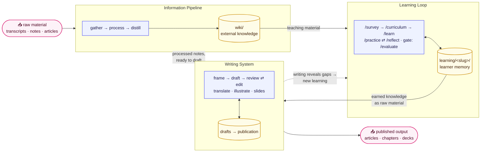

# Learning OS

Last updated: 2026-09-01

<div align="center">

[](.claude-plugin/plugin.json)
[](https://agentskills.io)
[](LICENSE)

**Gather information well, learn it deeply, and prove it in writing.**

AI makes consuming knowledge nearly free, but consuming is not learning — and learning that never produces anything is not finished. Learning OS is a file-based system of agent skills built around learning by doing: an information pipeline feeds a rigorous learning loop, and a writing system turns what was learned into published output — the proof that no assistance is needed anymore.

</div>

## What Is This?

Three connected systems, each a folder of composable skills:

```text
gather → process → distill    →    learn · practice · evaluate    →    draft → review → publish
   Information Pipeline                   Learning Loop                    Writing System
   skills/pipeline/                       skills/learning/                 skills/writing/
```

- **[Information Pipeline](skills/pipeline/README.md)** — turn raw material (transcripts, course notes, articles) into clean, source-faithful, teaching-ready knowledge. Nothing enters the system without provenance.
- **[Learning Loop](skills/learning/README.md)** — build durable capability with evidence: map the field, build a course, be tutored, practice on real cases, evaluate, reflect. AI guides thought; the learner constructs the answers.
- **[Writing System](skills/writing/README.md)** — turn earned knowledge into articles, chapters, translations, diagrams, and slides in fast iterations. Writing is the graduation artifact: what you can publish unaided, you have learned — and what you can't write yet, you haven't.

Each skill is a plain-Markdown `SKILL.md` in the open [Agent Skills](https://agentskills.io) format, so the suite is not tied to one tool: install it as a [Claude Code](https://docs.anthropic.com/en/docs/claude-code) plugin, symlink the skill directories into any skills-aware agent (Codex, Cursor, custom Claude Agent SDK agents, …), or paste a `SKILL.md` into any capable LLM chat as instructions.

Everything is plain Markdown and HTML on disk. Skills coordinate only through files — never hidden session state — so every artifact is inspectable, versionable, and yours.

> [!NOTE]
> Each system README is the canonical target architecture for that system. Durable design rationale is recorded in [docs/adr.md](docs/adr.md); unfinished work is tracked under [docs/exec-plans/](docs/exec-plans/).

## Architecture



The boundaries are strict: the pipeline produces teaching material, never learner evidence; the learning loop earns capability with visible assistance levels; the writing system publishes only what can stand on its own. Each system's README carries its full contract.

## Getting Started

### Prerequisites

Any AI agent that supports Markdown skills — Claude Code, Codex, or another skills-aware agent. As a fallback, any capable LLM chat works: the skills are plain instructions.

### Install

**Option A — Claude Code plugin** (inside a Claude Code session):

```text
/plugin marketplace add XinheLIU/learning-os
/plugin install learning-os@learning-os
```

**Option B — any skills-aware agent:** symlink the skill directories (note the `*/*` — skills live one level down, grouped by system):

```bash
git clone https://github.com/XinheLIU/learning-os
ln -s "$(pwd)/learning-os/skills/"*/* ~/.claude/skills/   # Claude Code, without the plugin
ln -s "$(pwd)/learning-os/skills/"*/* ~/.codex/skills/   # Codex
```

**Option C — no agent at all:** open the relevant `skills/<system>/<name>/SKILL.md` and paste it into an LLM chat as instructions. Each `SKILL.md` is self-contained; you play the role of the file system.

### First session

Skills read and write files relative to **the directory where you run your agent** — pick a folder for your learning materials, then:

```text
/survey distributed systems        # ~30 min: map the field, triage DEEP/SKIM/SKIP, pick sources
/curriculum consensus algorithms   # design + build an HTML course grounded in the survey
/learn consensus algorithms        # be tutored through the next lesson, dialogue-first
```

Close the loop after a few sessions (`/practice`, `/evaluate`, `/reflect`), and run `/recall` on the days between — it fires whatever is due across every course in ten to fifteen minutes. Then prove it in writing:

```text
/frame-piece find the angle for a piece from my raft learning notes
/write-content draft it from the brief
/review-draft check section 2
```

`/frame-piece` is the conversation that decides what the piece argues and what gets cut; skip it and you get a faithful explainer of your sources, which is sometimes exactly what you want.

## The Skills

Twenty-three skills across the three systems. Each table links to the system contract; detailed behavior lives in each skill's `SKILL.md`.

### [Information Pipeline](skills/pipeline/README.md) — `skills/pipeline/`

| Skill | Responsibility |
| :--- | :--- |
| `clean-notes` | Clean one material's raw capture: cluster by topic, dedupe, fix formatting |
| `organize-docs` | Restructure document collections into a MECE system |
| `llm-wiki-init` | Scaffold a new external knowledge base |
| `llm-wiki-ingest` | Preserve and distill curated sources into the wiki |
| `llm-wiki-lint` | Audit links, orphans, drift, and tag sprawl |
| `llm-wiki-book` | Turn a mature wiki into a thesis and narrative book plan |

### [Learning Loop](skills/learning/README.md) — `skills/learning/`

| Skill | Responsibility |
| :--- | :--- |
| `/survey` | Investment gate: map, critical path, sources, baseline |
| `/curriculum` | Build the course, planned backward from a real output |
| `/learn` | AI tutor: prediction, construction, feedback, retry |
| `/recall` | The return path: test due items cold, record, reschedule |
| `/practice` | Deliberate practice on real cases, attempts recorded |
| `/evaluate` | Evidence-backed mastery snapshot; the tier gate |
| `/reflect` | Compress errors into what changes next |
| `/synthesis-research` | Resolve live tensions into the learner's own judgment |

### [Writing System](skills/writing/README.md) — `skills/writing/`

| Skill | Responsibility |
| :--- | :--- |
| `frame-piece` | Find the angle: propose candidates, dialogue to a committed angle and cut-list, emit `brief.md` |
| `build-skeleton` | Create and maintain publication structure and navigation |
| `write-content` | Turn a brief, or source materials, into publishable nonfiction |
| `review-draft` | Ranked findings on any unit — depth gate first, then craft. Never rewrites |
| `edit-targeted` | Apply one instruction to one location; minimal diff |
| `book-translator` | Translate chapters between English and Chinese |
| `book-diagrams` | Coherent SVG diagrams for long-form content |
| `insert-inline-images` | Place existing images where the document needs them |
| `create-tech-slides` | Dense technical HTML slide decks |

## Repository Structure

```text
learning-os/
├── README.md                # this file — the front door
├── skills/
│   ├── pipeline/            # gather → process → distill   (+ README: pipeline contract)
│   ├── learning/            # the learning loop            (+ README: target architecture)
│   └── writing/             # writing & publishing         (+ README: workflows & principles)
├── docs/                    # architecture decisions and unfinished execution plans
├── .claude-plugin/          # plugin manifest + flat skill symlinks (Claude Code install path)
├── catalog/                 # shared-catalog metadata (skill-set.json) for the agent-skills hub
├── test-cases/              # contract fixtures: compliant / non-compliant skill artifacts
└── tmp/                     # gitignored iteration corpus for pipeline & writing skills (see tmp/README.md)
```

Each `SKILL.md` is the full contract for its skill: triggers, rules, storage paths, output formats, and a `## Handoffs` block of artifact-based triggers. Skill directories are physically grouped by system; flat symlink layers under `.claude-plugin/skills/` (and gitignored agent mirrors) keep discovery working. The rationale is recorded in [ADR-002](docs/adr.md#adr-002-keep-nested-ownership-and-flat-discovery-layers); regeneration instructions live in `AGENTS.md`.

## Project Status

All 23 skills have first versions. The remaining work is explicit: [learning](docs/exec-plans/learning.md), [writing](docs/exec-plans/writing.md), and [repository integration](docs/exec-plans/repository.md).

Learning OS publishes its shared-catalog metadata through [`catalog/skill-set.json`](catalog/skill-set.json); the [agent-skills](https://github.com/XinheLIU/agent-skills) hub owns the common discovery frontend. The project was extracted from that hub into its own repository.

## License

Distributed under the MIT License. See [LICENSE](LICENSE) for details.

## Contact

Xinhe LIU — [github.com/XinheLIU](https://github.com/XinheLIU)

Project: [github.com/XinheLIU/learning-os](https://github.com/XinheLIU/learning-os)
