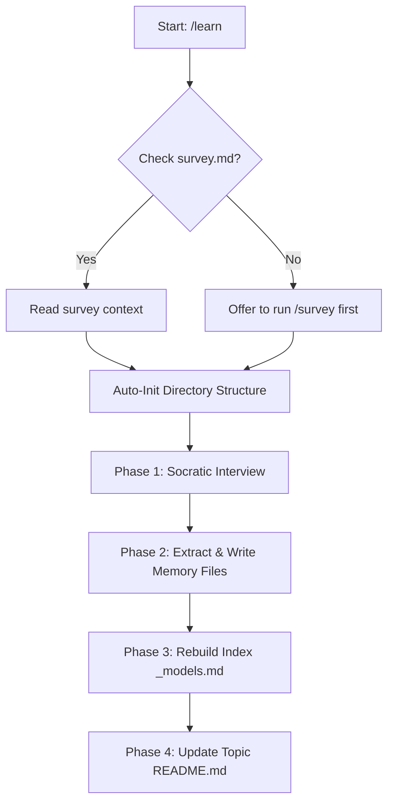

# Learn Skill (`/learn`)

An interactive, conversation-driven skill designed to build mental models for a new domain through Socratic interviewing. Rather than lecturing in a void or relying on pre-decided static templates, this skill engages in human-in-the-loop (HITL) exploration so that model architectures emerge directly from concrete cases and human insight.

---

## Core Philosophy

- **Interview Before Instructing**: The AI does not lecture. It asks what you already know, what you've built, and what confuses you. Your unique perspective drives the landscape.
- **Models Emerge from Cases**: Rather than forcing a fixed set of theories, models are drawn organically from your experiences (successes and failures).
- **Extremely Short Files**: Each mental model is captured in a standalone file. If it takes longer than 30 seconds to read, it must be divided.
- **Human-in-the-Loop**: The user names the models and provides real-world boundary examples; the AI sharpens, connects, and stress-tests them.

---

## Workflow Flow



### 1. Auto-Initialization
When a new topic slug is started, the skill immediately provisions the workspace structure without interrupting the flow:
```
topics/<slug>/
├── memory/                 # Flat folder for model & case files
└── README.md               # Minimal tracking index
```

### 2. Socratic Interview Phase
The AI asks targeted questions one at a time, adapting to your responses:
1. **Establish Baseline**: Discover your current expertise level, projects completed, and motivation.
2. **Surface Core Problems**: Force articulation of what the field *actually solves* and what makes it difficult.
3. **Iteratively Build Models**: Highlight personal success/failure stories, name patterns, identify concrete applications, specify boundary failure cases, and map linkages to other theories.
4. **Surface Controversies**: Explore ongoing industry disagreements or personal points of contention.

### 3. Writing Memories
The skill generates highly structured, bite-sized files for each model under `topics/<slug>/memory/model-<name>.md`:

```markdown
# <Model Name>

**What it is:** <1-2 sentences describing the core concept>

**Why it matters:** <1 sentence outlining what decision this model informs>

**Example:** <1 concrete, real-world case described in 2-3 lines>

**When it fails:** <boundary condition where the model breaks down>

**Connects to:** [[other-model]], [[another-model]]
```

It also maintains a consolidated table of contents in `topics/<slug>/memory/_models.md`.

---

## Warnings & Best Practices

> [!WARNING]
> - **Never pre-lecture**: Avoid teaching before asking what the user already knows.
> - **Do not force count**: Stop when the user has surfaced their solid models (even if it's only 2 or 3).
> - **Keep it brief**: Model files must be short and crisp. Avoid unnecessary fluff or placeholders.
> - **Earned models only**: If the user cannot provide a concrete example of a model, it is not "earned" yet. Do not write it down.
