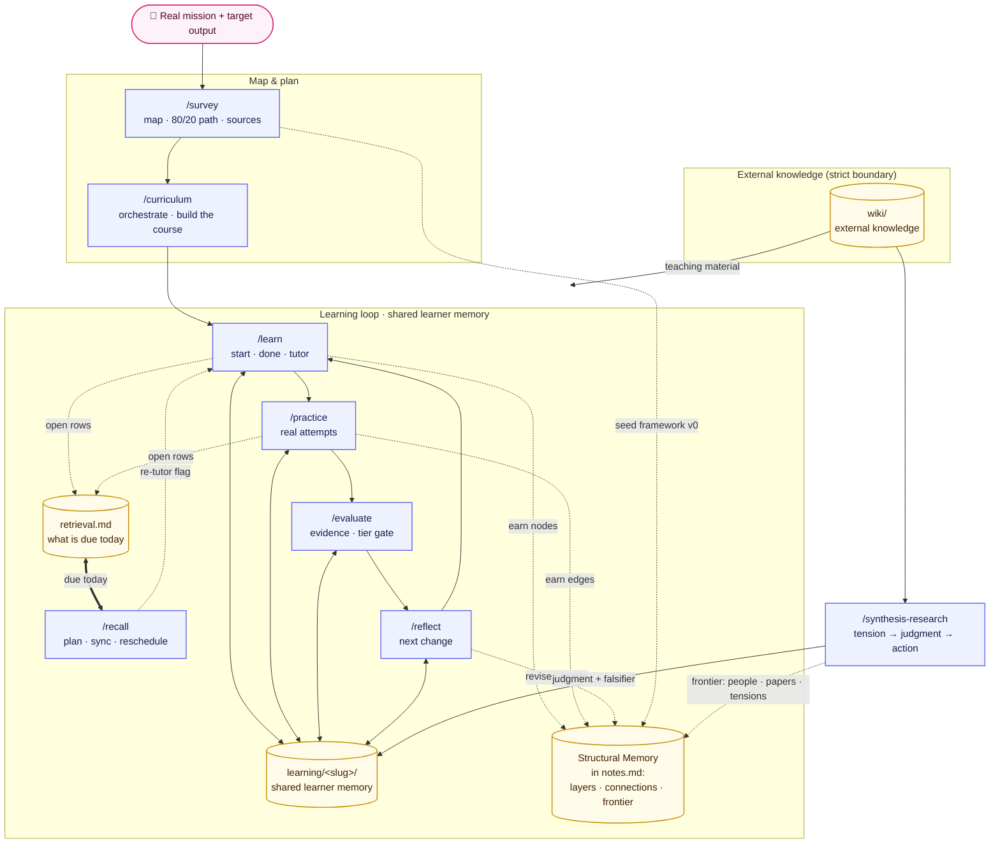

# The Learning Loop

Last updated: 2026-09-06

**Learn deeply, with evidence — until the assistance is no longer needed.**

AI makes consuming knowledge nearly free, but consuming is not learning. The learning system turns an AI agent into a tutor, coach, and evaluator: AI accelerates mapping, explanation, practice, and feedback, while the learner supplies the predictions, attempts, explanations, decisions, and judgment that make capability durable.

This document is the canonical **target architecture** for the learning system. [`docs/exec-plans/learning.md`](../../docs/exec-plans/learning.md) contains only the work still required. For the whole three-system picture (information pipeline → learning loop → writing system), see the [root README](../../README.md).

## The interaction contract (v3)

**The HTML course carries the learning experience.** Reading, opening tasks, drills, quizzes, mini-cases, and spaced recall all happen in the browser — completable, checkable, and closable inside the page. **Chat is reserved for exactly two things:**

1. **Bookkeeping** — after a lesson, the learner pastes its completion manifest with `done L<n>`; the agent records what was earned (`notes.md`, `retrieval.md`, syllabus checkbox) and says what comes next. Short and mechanical — never a re-teach.
2. **Questions** — the learner asks; the AI answers as a tutor. Always learner-initiated.

The learner's chat surface is four verbs: `/learn <slug>` (open the next lesson), `done L<n>` (bookkeeping), `/recall` (what's due → `recall.html`), `sync recall` (apply recall results). Everything else — practice, evaluation, reflection — starts from evidence these four produce.

The planning handoff is unified: `/survey` records a Mission Contract, Roadmap, and gap; `/curriculum`
preserves those decisions in `syllabus.md`, adds checkpoints and a bounded Memory Budget; `/learn`
orients each lesson to its checkpoint and records conceptual plus operational evidence. Operational
memory covers only mission-critical commands, shortcuts, patterns, and recovery actions. It uses the
existing retrieval ledger and may optionally use a learner-built memory palace; imagery never replaces
behavioral evidence.

## The Skills

| Component | Command | Primary responsibility | Durable output |
| :--- | :--- | :--- | :--- |
| Investment gate | `/survey` | Define the map, critical path, source set, and baseline | `survey.md`, Structural Memory v0 in `notes.md` |
| Course orchestrator & builder | `/curriculum` | Plan backward from the output; build the Tier-1 course and orchestrate the loop inside it | `syllabus.md` (+ `Next:`/`Gate:` fields), HTML course (K/S lessons + mini-cases with checkpoint blocks, `recall.html`, loop-entry specs) |
| Session manager & AI tutor | `/learn` | Open revised lessons (`start`); record earned knowledge from completion manifests (`done`); answer questions (`tutor`) | lesson progress, `notes.md`, `reference/`, promoted Structural Memory nodes, opened ledger rows, fresh recall queue |
| Retrieval planner | `/recall` | Compute what's due, point at `recall.html`, apply scheduling rules to synced results | `retrieval.md`, refreshed recall queue |
| Practice coach | `/practice` | Train one micro-skill on a real case and record attempts | `case-*.md`, Micro-Skills in `notes.md`, earned Structural Memory edges |
| Evaluator | `/evaluate` | Assess evidence, transfer, and independence; gate the tiers | Mastery Snapshot in `notes.md` |
| Feedback loop | `/reflect` | Convert errors and drift into changed models and next attempts | model revisions, micro-goals, Playbook in `notes.md`, framework iterations |
| Research companion | `/synthesis-research` | Resolve a live tension into the learner's judgment and action; extend the frontier | `research-*.md`, Structural Memory frontier |

`/recall` is the loop's **return path**. Every other skill moves knowledge forward; this one is the
only thing that comes back for it. A lesson checkbox is terminal, but a ledger row keeps coming due.

## Architecture

Each component is an atomic skill with file-based inputs and outputs. The learning-loop skills surround one shared topic memory: they read the learner's current state before acting and write durable attempts, evidence, and adaptations afterward. Because coordination happens through files rather than hidden session state, each skill remains independently testable and replaceable.



`wiki/` is produced and maintained by the [information pipeline](../pipeline/README.md) (`llm-wiki-*`); the learning loop only reads it as teaching material.

## Core Thesis

Learn toward an output, not a subject.

A topic is unbounded. An output creates a boundary, a quality bar, and evidence:

```text
"Learn SQL"                           -> unbounded subject
"Diagnose and fix our slow report"   -> real output
"Explain the query plan unaided"     -> evidence of understanding
"Fix a new slow query unaided"       -> evidence of transfer
```

The system optimizes the shortest useful loop between ignorance and correction. Every pass reads from and writes to the same topic memory:

```text
┌────────────────────── learning loop ──────────────────────┐
│ retrieve -> predict -> attempt -> feedback -> retry       │
│     ↑                                      ↓              │
│     └── learning/<slug>/ shared memory <── record         │
└────────────────────────────────────────────────────────────┘
                              |
                              +-> compress -> transfer -> update the path
```

Reading speed is not the bottleneck. Iteration speed is. Feedback matters only when it changes the next attempt, and AI assistance succeeds only when it can be reduced over time.

## Design Principles

| Area | Principle | Design consequence |
| :--- | :--- | :--- |
| Direction | Learn toward an output, not a subject. | Every topic begins with a real deliverable and observable success criteria. |
| Direction | Build the map before exploring the territory. | Identify prerequisites, core concepts, advanced branches, and the critical path before deep study. |
| Direction | AI provides speed; judgment provides direction. | AI proposes the map and path; the learner confirms the mission, tradeoffs, and final judgment. |
| Cognition | Let AI guide thought, not replace it. | AI asks, decomposes, hints, challenges, and gives feedback; the learner constructs the answer. |
| Cognition | Prediction creates learning; explanation creates familiarity. | Ask for a prediction or attempt before revealing an explanation whenever prerequisites permit. |
| Cognition | Practice begins before understanding feels complete. | Each small knowledge chunk is followed immediately by use; practice does not wait for total coverage. |
| Cognition | Every input becomes an output. | A source, lesson, or explanation must produce a prediction, example, solution, explanation, decision, or artifact. |
| Practice | Real problems teach faster than artificial exercises. | Prefer the learner's live tasks; use synthetic exercises only to isolate a blocked micro-skill. |
| Practice | Feedback is valuable only when it changes the next attempt. | Every correction is followed by a retry or a stated change tested in the next case. |
| Practice | Mistakes are a personalized curriculum. | Errors are recorded, clustered, and converted into the next micro-goals. |
| Practice | Debugging reveals deeper understanding than memorization. | Learners diagnose failures, state hypotheses, test them, and revise the model. |
| Memory | Compression turns information into knowledge. | Learners produce concise models, checklists, explanations, and playbooks after use. |
| Memory | Retrieval strengthens memory; rereading strengthens illusion. | Sessions open with recall from memory and interleave earlier knowledge; every earned item enters `retrieval.md` and comes back due on an expanding interval. |
| Memory | A checkbox is terminal; a due date is not. | Lesson completion closes nothing on its own — the return path is `/recall`, and evidence is not pruned until an item has survived two unaided cold recalls. |
| Memory | Teach to discover what you do not understand. | Learners explain in plain language; AI attacks omissions and hidden assumptions. |
| Memory | Store insights as reusable systems, not scattered notes. | Earned knowledge becomes records, reference material, error patterns, and defended playbooks. |
| Autonomy | Reduce guidance until the learner can act alone. | Track assistance used and deliberately fade examples, prompts, hints, and checks. |
| Autonomy | Measure independent capability, not time spent. | Advancement requires unaided output on a new case, not lesson completion or study hours. |
| Autonomy | The fastest learner is the fastest iterator. | Keep attempt-feedback-retry cycles small and frequent. |
| Autonomy | Tenfold learning comes from shortening ignorance-to-correction. | Put feedback and retry inside the same session and feed recurring errors into the next one. |
| Autonomy | The purpose of AI-assisted learning is to need less assistance. | Graduation means producing and judging the target output without AI support. |

## Operating Model

The journey climbs three tiers on one shared mastery ladder. Each tier owns its rungs, and `/evaluate` — the tier gate — declares a mainline's transition only when the exit evidence exists:

| Tier | Skills | Builds | Owns rungs | Exit gate (per mainline) |
| :--- | :--- | :--- | :--- | :--- |
| 1 — Course | `/survey` → `/curriculum` → `/learn` | knowledge → skill | can-recall, can-apply | all K/S lessons closed; every can-apply cell's named sample reproduced at assistance ≤ hint |
| 2 — Learning loop | `/practice` ⇄ `/reflect` (+ `/evaluate`) | skill → wisdom | can-transfer | target cell evidenced by a case outside the home domain or on the learner's own project (none/hint); ≥1 earned cross-mainline edge in the Structural Memory section of `notes.md` |
| 3 — Research companion | `/synthesis-research` (+ wiki) | wisdom → generation | can-generate → can-teach | research report with judgment + falsifier; graduation = teach-back that survives a misconception |

Throughout, the Structural Memory section of `notes.md` is the convergence target: `/survey` seeds its skeleton top-down, the loop earns it bottom-up, and `/synthesis-research` grows it past the course.

`/recall` sits outside the tier table on purpose: it owns no rung. Tiers describe how deep capability goes; retrieval describes whether it is still there. A row opened by a Tier-1 lesson and a row opened by a Tier-2 case are fired the same way, so `/recall` runs across all three tiers and gates none of them. What it produces is not a mastery claim — `/evaluate` reads the ledger as corroboration and still requires its own rubric evidence.

### 1. Define the output

Start with a mission that changes something in the learner's work or life. Define:

- **Target output:** what the learner will produce or do.
- **Quality bar:** what a good result must satisfy.
- **Transfer test:** a new situation in which the capability must still work.
- **Independence test:** the same class of task completed without AI guidance.
- **Constraints:** time, tools, prior knowledge, and explicit non-goals.

Time is a planning constraint, not evidence of learning.

### 2. Build the map

Before deep study, `/survey` creates a bounded field map:

- prerequisites, core knowledge, and advanced branches;
- the 20% of concepts that unlock roughly 80% of common work;
- DEEP, SKIM, and SKIP decisions with reasons;
- a diagnosis of current capability, based on probes rather than self-report;
- three to five high-value resources, each annotated with what it is for;
- controversies and unknowns that may need `/synthesis-research`.

The map is a hypothesis. Evidence from practice can send the learner back to revise it.

### 3. Plan backward from capability

`/curriculum` turns the output and map into a staged path. A default plan uses weekly checkpoints for coordination, but each checkpoint is gated by evidence:

| Stage | Input | Practice | Required output |
| :--- | :--- | :--- | :--- |
| Orient | Map and a minimal worked example | Predict outcomes and identify unknowns | Baseline attempt |
| Build | One prerequisite or core chunk | Retrieval and a small application | Plain-language model or solved subproblem |
| Integrate | Several earned chunks | Whole-task attempt | Target output with limited guidance |
| Transfer | A new real case | Diagnose, decide, and act | Target output in a different context |
| Graduate | No new instruction | Independent performance | Output meeting the quality bar unaided |

Knowledge, skill, and wisdom still form a depth ladder, but not a waterfall. The loop is local: learn one necessary chunk, use it, inspect failure, then learn the next chunk.

### 4. Run the learning loop

`/learn`, `/practice`, `/evaluate`, and `/reflect` form one loop around `learning/<slug>/`, with `/recall` running across it on its own schedule. They do not hand state directly to one another: each reads the shared files it needs and writes durable evidence for the next skill. One invariant attempt loop runs through the whole system — embedded in the HTML lessons (opening task → check-yourself → checkpoint) and in `/learn`'s tutor mode and `/practice`'s coaching dialogue alike:

```text
1. Retrieve a prerequisite from memory.
2. Predict or attempt before seeing the answer.
3. Receive the minimum explanation or worked example needed.
4. Explain, solve, or demonstrate in the learner's own words.
5. Get precise feedback, ordered by severity.
6. Retry the same task or a near-transfer variant.
7. Compress the corrected model into a reusable artifact.
8. Record the assistance used and set the next attempt.
```

For a true novice, the initial prediction is low-stakes and the explanation can be direct. The learner still has to construct and retry before the segment closes.

### 5. Use the AI Feynman protocol

For a difficult concept:

1. **Minimal explanation:** AI explains it in language a 12-year-old can understand, gives three real examples, and avoids unnecessary terminology.
2. **Closed-book teach-back:** the learner closes the material and explains the concept in their own words.
3. **Adversarial feedback:** AI lists errors, omissions, and distortions in severity order.
4. **Correction:** the learner studies only the identified gaps.
5. **Retry:** the learner explains again or applies the concept to a new case.

Example prompts:

```text
Explain <concept> in language a 12-year-old can understand. Give three
real examples and avoid specialist terms. Before explaining, ask me for
one prediction about how it behaves.
```

```text
I will explain <concept> from memory. Identify errors, omissions, and
distortions, ordered by severity. Do not rewrite it for me; ask me to
correct the most serious issue first.
```

Familiarity with the AI's explanation is not completion. A corrected learner explanation or application is.

### 6. Turn errors into the next curriculum

`/practice` captures errors from real cases. `/reflect` compresses recurring patterns and changes the next micro-goal. A useful error record contains:

```text
attempt -> observed failure -> hypothesis -> feedback -> retry -> result
```

Debugging is the preferred learning mode when a model fails: reproduce the failure, localize it, predict a cause, test the prediction, and revise the model.

### 7. Compress and store what was earned

The system separates external information from learner-owned knowledge:

- `wiki/` stores source-faithful external knowledge.
- `learning/<slug>/` is the shared memory of the learning loop: it stores the plan, capabilities, attempts, assistance, evaluation, and adaptations earned through work.

Compression happens after construction. AI may propose a draft, but an artifact becomes earned knowledge only after the learner can explain, use, or defend it. Durable outputs include:

- concise mental models and canonical terms in `notes.md`;
- earned structure — layered nodes, labeled connections, the frontier — in the Structural Memory section of `notes.md`;
- retrieval history — intervals, streaks, lapses — in `retrieval.md`;
- printable reference cards in `reference/`;
- micro-skill maps in the Micro-Skills section of `notes.md`;
- real attempts and error histories in `case-*.md`;
- judgments and falsifiers in `research-*.md`;
- defended procedures and decision rules in the Playbook section of `notes.md`.

### 8. Fade support and prove independence

Assistance should move in one direction:

```text
worked example -> partial example -> prompts -> hints on request ->
feedback after attempt -> feedback after completion -> unaided transfer
```

`/evaluate` measures the strongest evidence available and records how much assistance produced it. `/reflect` chooses what support to remove next. A learner graduates only when they can produce the target output on a new case, explain the important decisions, diagnose failure, and self-correct without AI guidance.

## File Contracts

### Learner memory

`learning/<slug>/` is the shared durable state. All skills read from and write to these files:

| Artifact | Owner(s) | Readers | Content | Lifecycle |
|----------|----------|---------|---------|-----------|
| `survey.md` | `/survey` | `/curriculum`, `/learn`, `/practice`, `/reflect` | Investment matrix, mainlines × stages, triage, gap diagnosis, curated sources | Created once, refined by `/survey` deepening pass |
| `syllabus.md` | `/curriculum` | `/learn`, `/evaluate` | Mission Contract, Roadmap, checkpoints, Memory Budget, staged lesson specs (K/S/W) with `Next:`/`Gate:` orchestration fields, checkboxes | Created by `/curriculum`, checkboxes updated by `/learn` & `/evaluate` |
| `index.html` | `/curriculum` | human | Course shell: mission, stages, lesson list with progress (rendered from syllabus.md) | Generated by `/curriculum`, updated on checkpoint |
| `lessons/*.html` | `/curriculum`, `/learn` | human | K/S lesson + mini-case content (Stages 1–3): interactive, opening task first, drills/quizzes, **checkpoint block** closing the lesson | Authored by `/curriculum`, revised by `/learn` per learner |
| `recall.html` | `/curriculum`, `/learn`, `/recall` | human | The return path: due items as flashcards (prompt, reveal, self-grade, sync block) | Built by `/curriculum`; embedded queue refreshed by `/learn` & `/recall` at every bookkeeping pass |
| `reference/*.html` | `/curriculum`, `/learn` | human | Compressed reference docs: cheat sheets, glossary, syntax cards | Seeded by `/curriculum`, extended by `/learn` |
| `notes.md` | `/learn`, `/practice`, `/evaluate`, `/reflect` | all skills | Records, attempt log, terms, **operational memory**, **structural memory**, **micro-skills**, **playbook**, preferences, mastery snapshot | Grows through the loop, pruned by `/reflect` |
| `retrieval.md` | `/learn`, `/practice`, `/recall` | `/recall`, `/evaluate` | Retrieval ledger: schema, term, and operational items, intervals, due dates, lapses, state | Rows opened by `/learn` & `/practice`, fired in `recall.html`, rescheduled by `/recall` |
| `case-*.md` | `/practice` | `/evaluate`, `/reflect` | Practice attempts: scenario, models applied, errors, assistance, retry cycles | One file per case, read-only after creation |
| `research-*.md` | `/synthesis-research` | `/evaluate`, `/reflect` | Synthesis research: judgment, falsifier, frontier | One file per synthesis question |

**Key changes from v1**:
- `framework.md`, `drills-*.md`, and `playbook.md` are now consolidated into `notes.md` sections (`## Structural Memory`, `## Micro-Skills`, `## Playbook`)
- `syllabus.html` eliminated — `index.html` renders syllabus.md directly
- Reduced from ~14 artifacts per topic to ~10

**Key changes from v2 (v3 — HTML-first)**:
- Every lesson ends in a **checkpoint block**: a completion-manifest button (packages the page's quiz/drill state as JSON) + a next-step card. The paste-back manifest is the done-signal; `/learn` does bookkeeping from it instead of re-teaching in chat.
- **`recall.html`** is the return path: due items fire in the browser (prompt alone, reveal, self-grade); `/recall` plans and reschedules — it never quizzes in chat.
- **Mini-cases get lesson files**; Stage 4–5 W entries remain chat-executed loop-entry specs.
- `syllabus.md` carries the orchestration contract: `Next:` pointers and recall `Gate:` conditions per lesson.

`notes.md` now holds *evidence* (Records, Attempt Log), *structure* (Structural Memory: layers, nodes/edges, earned vs target, iteration), *micro-skills* (decomposition per skill area), and *defended procedures* (Playbook). A node or edge flips to `earned` only with an evidence pointer produced at assistance `none`/`hint` — coached work never earns structure. `/learn` promotes nodes, `/practice` earns edges, `/reflect` revises and bumps the iteration counter, `/synthesis-research` owns the frontier; `/curriculum` and `/evaluate` only read it.

The same first-successful-demonstration moment that promotes a framework node also opens a `retrieval.md` row — one per **item**: a schema or a term testable by a single cold prompt. Rows are never opened at exposure, and coached demonstrations open none. They fire in `recall.html` (prompt alone, reveal, self-grade) and `/recall` alone reschedules them; a firing records a correctness bit and an assistance level on two separate axes ([ADR-005](../../docs/adr.md#adr-005-score-retrieval-on-correctness-and-assistance-separately)). Full spec: [learn/references/retrieval.md](learn/references/retrieval.md).

`notes.md` consolidates all learner memory into one file:

```markdown
# Notes: <topic>

## Records
### 0001 - <demonstrated understanding>  (<date>)
<what was established and why it changes future teaching>
**Evidence:** <how the learner demonstrated it>
**Assistance:** none | hint | walkthrough | solution-shown

## Attempt Log
- <date> <lesson-id> <task>: predicted <X> -> <right | wrong: Y> -> retry <resolved | narrowed: Z | failed> [assistance: <enum>]

## Terms
- **term-name** — definition and usage

## Structural Memory
(was framework.md: layers, nodes/edges with earned vs target status, iteration counter)

### Layers
...

### Map
...

### Frontier
...

## Micro-Skills
(was drills-*.md: decomposition per skill area)

### Micro-skill: <name>
- Cell: <mainline × stage>
- Failure modes: ...
- Success criteria: ...
- Difficulty curve: ...

## Playbook
(was playbook.md: defended procedures)

### <procedure-name>
...

## Preferences
- preference statements

## Mastery Snapshot — <date>
(from /evaluate: evidence-backed rubric levels per node)
```

Each new `case-*.md` keeps the full sequence. `Micro-goal` and `Errors made` remain mandatory; `Cell` is also required when `survey.md` exists.

```markdown
**Attempt 1:** <what the learner tried>
**Observed failure:** <what happened>
**Hypothesis:** <learner's cause>
**Feedback:** <correction>
**Retry:** <changed attempt>
**Result:** resolved | narrowed: <remaining error> | failed

**Assistance used:** none | hint | walkthrough | solution-shown
**Next support to remove:** <specific scaffold to withhold next time>
```

Repeat the attempt block as needed and record the case's most-assisted level. Cases created before 2026-07-23 are historical artifacts: they remain unchanged and their assistance is unknown.

### External knowledge

The boundary with the pipeline's `wiki/` is strict:

- Learning-loop skills never write directly to `wiki/`.
- The `llm-wiki-*` suite never writes to `learning/`.
- Wiki pages are teaching material, not evidence that the learner understands.
- Learning records require a learner-generated attempt that survived feedback.

The wiki layout itself is defined in the [pipeline contract](../pipeline/README.md).

## Evidence Model

Capability is cumulative, but assistance is always visible:

| Level | Minimum evidence |
| :--- | :--- |
| Can recall | Correct closed-book retrieval — a `recall.html` firing graded clean at assistance `none` is the canonical instance |
| Can explain | Plain-language explanation that survives challenge |
| Can apply | Successful use in a real case |
| Can debug | Failure localized and corrected through a tested hypothesis |
| Can transfer | Successful use in a different domain or unfamiliar case |
| Can teach | Explanation plus response to a learner's misconception |
| Can generate | Defensible new judgment or model with a falsifier |
| Independent | New target output completed, judged, and self-corrected without AI |

Lesson completion and time spent are metadata, not mastery evidence.

Each rung has an owner: the course tier (`/survey` → `/curriculum` → `/learn`) climbs to can-recall and can-apply; the learning loop (`/practice` ⇄ `/reflect`, gated by `/evaluate`) earns can-transfer; `/synthesis-research` produces can-generate. Can-teach is the graduation test, and `Independent` spans all tiers — assistance fades everywhere. A [writing-system](../writing/README.md) artifact — an article or chapter produced at assistance none/hint — is the natural independent output.

## Cross-Cutting Rules

- **Output before syllabus:** no course without a target artifact and quality bar.
- **Map before depth:** no broad exploration without a critical path and explicit skips.
- **Attempt before answer:** explanations follow a prediction or attempt whenever possible.
- **Construction before storage:** AI-generated text is not learner-owned knowledge.
- **Feedback before closure:** a correction must change a retry or the next concrete attempt.
- **Real cases before artificial coverage:** isolate with drills only when a real task is too complex to diagnose.
- **Evidence before claims:** every capability claim points to an artifact.
- **Structure is earned:** framework nodes and edges flip to `earned` only with none/hint evidence — surveys seed, they never earn.
- **Items open on demonstration, never on exposure:** a `retrieval.md` row is created when the learner first demonstrates the item unaided or on a hint, not when it was taught. A ledger seeded at exposure fails everything on its first firing and reads as a broken scheduler rather than as forgetting.
- **Cold means cold:** a retrieval prompt is emitted alone. An answer, hint, or restatement in the same message makes the retrieval warm, and a warm retrieval recorded as cold corrupts every row it touches.
- **Independence before graduation:** assisted success is progress, not the end state.
- **Files are the interface:** no skill depends on another skill's session memory, and every handoff is an artifact condition, not a feeling of readiness.
- **Tutor, not answer machine:** decompose, hint, challenge, and fade support.

## Theoretical Foundation

Five theories answer different questions in one engine:

| Theory | Question | Operational use |
| :--- | :--- | :--- |
| Four Layers of Learning | What depth is being built? | Distinguish representations, schemas, models, and frameworks. |
| Cognitive Load | How should it be presented? | One new chunk, worked examples for novices, reduced support for experts. |
| ICAP | What must the learner do? | Move from receiving to constructing and defending. |
| Deliberate Practice | How does performance improve? | Train micro-skills at the edge of ability with rapid feedback and retries. |
| Synthesis Research | How is judgment created? | Combine conflicting evidence, locate the crux, decide, and state a falsifier. |

The full theory reference lives at [learn/references/learning-theory.md](learn/references/learning-theory.md).

## Non-Goals

- No numeric mastery scores.
- No graph database or shared agent memory service.
- No hard dependency on a wiki for ordinary learning.
- No AI-written judgment presented as the learner's own.
- No passive reading tracker treated as evidence.
- No requirement to finish understanding a field before attempting useful work.
- No permanent scaffolding.
